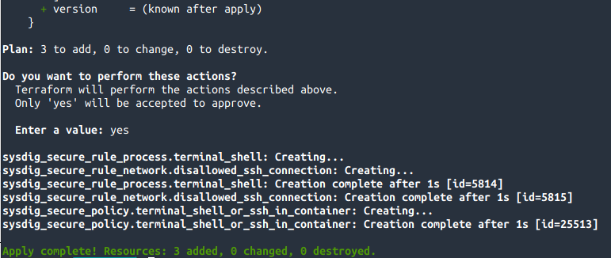
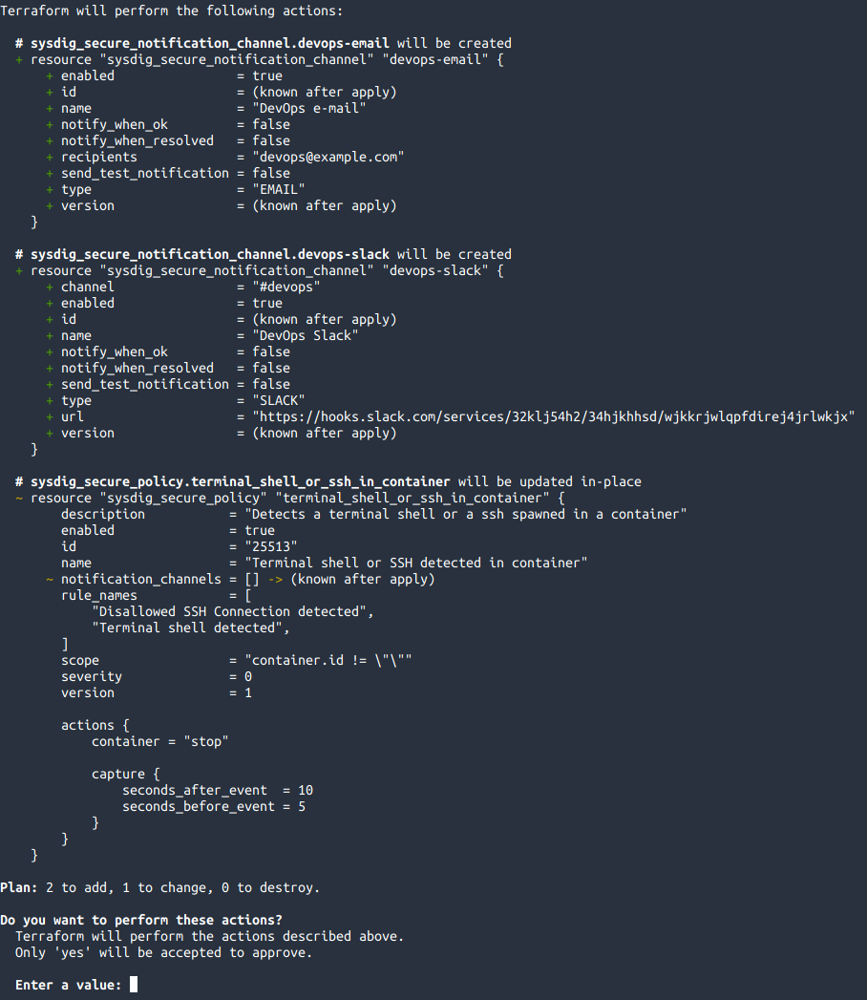

# Terraform Provider for Sysdig

## Introduction

### What is terraform

Terraform is a tool for building, changing, and versioning infrastructure safely and efficiently. 
Terraform can manage existing and popular service providers as well as custom in-house solutions.

Configuration files describe to Terraform the components needed to run a single application or 
your entire datacenter. Terraform generates an execution plan describing what it will do to reach the 
desired state, and then executes it to build the described infrastructure or configuration. 
As the configuration changes, Terraform is able to determine what changed and create incremental execution 
plans which can be applied.

### How can this integration help you

Messing up a configuration can have terrible consequences.
 
By following the GitOps principles, in which all the configuration has to be applied as code, 
committed into a git repository (the single source of truth), and reviewed by the whole team,
we can spot this kind of problem easily.
 
In case an error passed the reviews, a quick investigation would have revealed who and when 
changed the messed configuration, and fixing the issue would be as easy as reverting the 
configuration changes.

The Terraform Provider for Sysdig allows you to manage your configuration in Sysdig Secure 
and Sysdig Monitor as code, so this kind of scenario don't happen to you.

### What is a provider and how do they work

While resources are the primary construct in the Terraform language, 
the behaviors of resources rely on their associated resource types, 
and these types are defined by providers.

Each provider offers a set of named resource types, and defines 
for each resource type which arguments it accepts, which attributes it exports, 
and how changes to resources of that type are actually applied to remote APIs.

The Terraform Provider for Sysdig exposes resources like Alerts, Notification Channels, 
Falco Lists, Falco Macros, Policies, and many more, so you don't need to interact with the UI
to configure those, and enabling you to define and update them as code.

For more information, check: https://www.terraform.io/docs/configuration/providers.html


## Installation

To use the provider, first you need to install Terraform, which is the main executable that
interacts with the provider.

Download the Terraform executable for your OS/Architecture from 
here: https://www.terraform.io/downloads.html

When you have it installed, download the 
[latest version of the Terraform Provider for Sysdig](https://github.com/sysdiglabs/terraform-provider-sysdig/releases/latest)
for your OS/Architecture, extract it and move the executable under `$HOME/.terraform.d/plugins` (you need to create
this directory if it does not exist yet) as this link suggests: 
https://www.terraform.io/docs/configuration/providers.html#third-party-plugins.

## E2E example

Terraform understands that it needs to use the Sysdig provider when you specify a resource
or data source with a name starting with `sysdig_*` (i.e.: `sysdig_user`)

But in order to actually create valid requests to the API and create/update/remove those resources,
you need to specify a correct API token for the product.

You can do so in 2 ways:
1. Using environment variables
2. Using a tfvars file.

### Configure the provider: Using env vars

You can configure the following environment variables to specify the API token:
- `SYSDIG_SECURE_API_TOKEN`
- `SYSDIG_MONITOR_API_TOKEN`

For example:

```sh
$ export SYSDIG_SECURE_API_TOKEN=323232323-3232-3232-32323232
$ export SYSDIG_MONITOR_API_TOKEN=343434343-3434-3434-34343434
```

Once you execute Terraform an apply the manifests, that env vars will be used to configure
the provider and create API calls with them.

### Configure the provider: Using a tfvars file

To use a [tfvars file](https://www.terraform.io/docs/configuration/variables.html#variable-definitions-tfvars-files)
you need to first create it, and specify the API tokens as variables, for example:

```
# File: terraform.tfvars

secure_token = "323232323-3232-3232-32323232"
monitor_token = "343434343-3434-3434-34343434"
```

Then, you can reference it in the [provider configuration block](https://www.terraform.io/docs/configuration/providers.html#provider-configuration):

```hcl
provider "sysdig" {
  sysdig_monitor_api_token = var.monitor_token
  sysdig_secure_api_token  = var.secure_token
}
```

### Creating resources with Terraform

We are going to create a pair of rules able to detect SSH connections and shells spawned in containers.
                
We start by defining a couple of rules in the `rules.tf` file. One rule will detect inbound and outbound connections 
made to the port 22, and the other will detect a shell process being spawned.

```hcl
resource "sysdig_secure_rule_network" "disallowed_ssh_connection" {
  name           = "Disallowed SSH Connection detected"
  description    = "Detect any new ssh connection to a host"
  tags           = ["network"]

  block_inbound  = true
  block_outbound = true

  tcp {
    matching     = true
    ports        = [22]
  }
}

resource "sysdig_secure_rule_process" "terminal_shell" {
  name        = "Terminal shell detected"
  description = "A shell was used as the entrypoint/exec point"
  tags        = ["shell"]

  processes   = ["ash", "bash", "csh", "ksh", "sh", "tcsh", "zsh", "dash"]
}
``` 

Now we are going to create a policy in a file called `policy.tf` to define how these rules 
are applied. The policy will stop the affected container and trigger a capture for 
further troubleshooting. 

```hcl
resource "sysdig_secure_policy" "terminal_shell_or_ssh_in_container" {
  name        = "Terminal shell or SSH detected in container"
  description = "Detects a terminal shell or a ssh spawned in a container"
  enabled     = true
  severity    = 0 // HIGH
  scope       = "container.id != \"\""
  rule_names  = [sysdig_secure_rule_network.disallowed_ssh_connection.name,
                 sysdig_secure_rule_process.terminal_shell.name]

  actions {
    container               = "stop"
    capture {
      seconds_before_event  = 5
      seconds_after_event   = 10
    }
  }
}
```

With the given `scope`, the policy will only be applied to processes being executed inside containers:

```
scope = "container.id != \"\""
``` 

Let’s do a terraform apply to apply these resources in the backend: 


 Terraform tells us that is going to create 3 resources, which matches what we defined in `rules.tf` and `policy.tf`. 



 After applying the plan, Terraform reports that the 3 resources have been successfully created. The policy uses the 
 rules created before, that’s why it’s the last one being created.

The resources have been created, let’s see how they look in Sysdig Secure: 


Now we are protected against terminal shells or SSH connections in our container infrastructure using security as code. 
But wait, if this policy triggers we won’t notice unless we define a notification channel. 
Let’s create two notification channels, one for the email and another one for slack in a file called `notification.tf`:

```hcl
resource "sysdig_secure_notification_channel" "devops-email" {
  name                 = "DevOps e-mail"
  enabled              = true
  type                 = "EMAIL"
  recipients           = "devops@example.com"
  notify_when_ok       = false
  notify_when_resolved = false
}

resource "sysdig_secure_notification_channel" "devops-slack" {
  name                 = "DevOps Slack"
  enabled              = true
  type                 = "SLACK"
  url                  = "https://hooks.slack.com/services/32klj54h2/34hjkhhsd/wjkkrjwlqpfdirej4jrlwkjx"
  channel              = "#devops"
  notify_when_ok       = false
  notify_when_resolved = false
}
```

Let’s bind them to the policy as well modifying the file `policy.tf`, note the `notification_channels` property:

```hcl
resource "sysdig_secure_policy" "terminal_shell_or_ssh_in_container" {
  name        = "Terminal shell or SSH detected in container"
  description = "Detects a terminal shell or a ssh spawned in a container"
  enabled     = true
  severity    = 0 // HIGH
  scope       = "container.id != \"\""
  rule_names  = [sysdig_secure_rule_network.disallowed_ssh_connection.name,
                 sysdig_secure_rule_process.terminal_shell.name]

  actions {
    container               = "stop"
    capture {
      seconds_before_event  = 5
      seconds_after_event   = 10
    }
  }

  notification_channels = [sysdig_secure_notification_channel.devops-email.id,
                           sysdig_secure_notification_channel.devops-slack.id]
}
``` 

If we do a `terraform apply`, it will tell us that it will create 2 new resources and modify the existing policy:



 After inputting **yes**, Terraform will create the notification channels and bind them to the policy, ensuring that the state in Monitor and Secure matches our state defined in the code.

We can see those new resources appearing on Sysdig UI: 


Now, if someone tries to update it manually, we can always re-apply our policies, and Terraform will
restore the desired status from our `.tf` manifests.

## Reference to resources documentation

You can check all the available resources and datasources for the Terraform Provider for Sysdig here: 

[Terraform provider for Sysdig Datasources](./usage.md)

---

